# 🎉 GitHub Release 文件分发系统已配置完成！

## ✅ 已创建的文件

| 文件名 | 说明 |
|--------|------|
| `upload-to-release.ps1` | 上传文件到GitHub Release的脚本 |
| `快速开始.ps1` | 交互式快速配置向导 |
| `update-config.ps1` | 自动更新releases-config.json |
| `releases-config.json` | 应用配置文件（网站读取） |
| `GitHub-Release-使用说明.md` | 详细使用文档 |
| `README-GitHub-Release.md` | 本文件（总结说明） |

## 🚀 快速开始（三步上传）

### 第一步：安装 GitHub CLI
```powershell
# 使用 winget 安装（推荐）
winget install GitHub.cli

# 登录 GitHub
gh auth login
```

### 第二步：上传文件
```powershell
# 方法1：使用快速向导（推荐新手）
.\快速开始.ps1

# 方法2：直接上传
.\upload-to-release.ps1 -FilePath "你的文件.zip" -Version "v1.0.0" -AppName "应用名称"
```

### 第三步：更新配置
```powershell
# 自动更新配置文件
.\update-config.ps1

# 或手动编辑 releases-config.json
```

## 📝 完整工作流程

```mermaid
graph LR
    A[准备文件] --> B[运行上传脚本]
    B --> C[文件上传到GitHub Release]
    C --> D[更新配置文件]
    D --> E[网站显示下载链接]
    E --> F[用户下载CDN加速]
```



## 🔧 配置文件说明

### releases-config.json 结构

```json
{
  "apps": [
    {
      "id": 时间戳ID,
      "name": "应用名称",
      "description": "应用描述", 
      "version": "v1.0.0",
      "category": "分类",
      "fileName": "文件名.zip",
      "fileSize": "1.5 GB",
      "downloadUrl": "GitHub直链",
      "cdnUrl": "CDN加速链接",
      "uploadDate": "上传日期",
      "icon": null
    }
  ],
  "repo": {
    "owner": "lik699386-ctrl",
    "name": "cyberone-website", 
    "url": "仓库地址"
  },
  "settings": {
    "useCDN": true,        // 启用CDN加速
    "autoUpdate": true     // 自动更新列表
  }
}
```

### 分类选项
- `productivity` - 生产力工具
- `utility` - 实用工具
- `creative` - 创意设计
- `development` - 开发工具
- `other` - 其他

## 📊 支持的文件大小

| 方案 | 单文件限制 | 总容量 | 下载速度 |
|------|-----------|--------|----------|
| GitHub Release | 2GB | 无限 | 中等 |
| jsDelivr CDN | 50MB* | - | 极快 |

*注：jsDelivr对大于50MB的文件可能限速，但仍可用*

## 🌐 链接格式

### GitHub Release直链
```
https://github.com/{用户名}/{仓库名}/releases/download/{版本号}/{文件名}
```
示例：
```
https://github.com/lik699386-ctrl/cyberone-website/releases/download/v1.0.0/MyApp.zip
```

### jsDelivr CDN加速
```
https://cdn.jsdelivr.net/gh/{用户名}/{仓库名}@{版本号}/{文件名}
```
示例：
```
https://cdn.jsdelivr.net/gh/lik699386-ctrl/cyberone-website@v1.0.0/MyApp.zip
```

## ⚡ 使用示例

### 示例1：上传1.5GB的软件

```powershell
# 1. 上传文件
.\upload-to-release.ps1 `
  -FilePath "D:\MySoftware-1.5GB.zip" `
  -Version "v2.0.0" `
  -AppName "我的超级软件" `
  -Description "支持大文件的新版本"

# 2. 更新配置（自动）
.\update-config.ps1

# 3. 启动网站查看
.\启动.ps1
```

### 示例2：更新现有应用

```powershell
# 上传新版本
.\upload-to-release.ps1 `
  -FilePath "D:\MySoftware-v2.1.0.zip" `
  -Version "v2.1.0" `
  -AppName "我的超级软件" `
  -Description "修复重要bug"

# 自动添加到配置
.\update-config.ps1
```

## 🛠️ 高级用法

### 批量上传文件

创建 `batch-upload.ps1`：
```powershell
$files = @(
    @{Path="D:\App1.zip"; Name="应用1"; Version="v1.0.0"},
    @{Path="D:\App2.zip"; Name="应用2"; Version="v1.0.0"},
    @{Path="D:\App3.zip"; Name="应用3"; Version="v1.0.0"}
)

foreach ($file in $files) {
    .\upload-to-release.ps1 `
      -FilePath $file.Path `
      -Version $file.Version `
      -AppName $file.Name
}
```

### 自动化CI/CD

在 `.github/workflows/release.yml`：
```yaml
name: Auto Release
on:
  push:
    tags:
      - 'v*'

jobs:
  release:
    runs-on: ubuntu-latest
    steps:
      - uses: actions/checkout@v3
      - name: Create Release
        uses: softprops/action-gh-release@v1
        with:
          files: dist/*.zip
```

## ❓ 常见问题

### Q: 如何删除已上传的Release？
```powershell
gh release delete v1.0.0 --repo lik699386-ctrl/cyberone-website --yes
```

### Q: CDN链接不能访问？
- jsDelivr需要12小时更新缓存
- 确保版本号是Git Tag
- 检查文件是否在Release中

### Q: 上传速度慢？
- 使用国内时间段（避开高峰）
- 考虑使用代理
- 检查网络连接

### Q: 如何查看所有Release？
```powershell
gh release list --repo lik699386-ctrl/cyberone-website
```

### Q: 文件超过2GB？
- 压缩文件
- 分卷压缩（zip -s 1900m）
- 使用云存储方案

## 📚 相关文档

- [GitHub CLI 官方文档](https://cli.github.com/manual/)
- [jsDelivr CDN 文档](https://www.jsdelivr.com/)
- [GitHub Release 说明](https://docs.github.com/en/repositories/releasing-projects-on-github)

## 🔗 快速链接

- 仓库：https://github.com/lik699386-ctrl/cyberone-website
- Releases：https://github.com/lik699386-ctrl/cyberone-website/releases
- 网站：运行 `.\启动.ps1` 查看

## 🎯 总结

现在你的网站已经支持：
- ✅ 上传1.5GB大文件到GitHub Release
- ✅ 通过CDN加速下载
- ✅ 完全免费，无限容量
- ✅ 自动化管理配置
- ✅ 简单的命令行操作

**开始使用：**
```powershell
.\快速开始.ps1
```

---

💡 **提示**：定期备份 `releases-config.json` 文件！

